# Brain diffusion

A latent diffusion model that generates brain images of people with normal cognitive and Alzheimer's Disease.

## Table of contents

- [Dataset](#dataset)
- [File structure](#file-structure)
- [How it works](#how-it-works)
- [Advantages and disadvantages](#advantages-and-disadvantages)
- [Data preprocessing](#data-preprocessing)
- [Training](#training)
- [Results](#results)
- [Diffusion process](#diffusion-process)
- [Other attempts](#other-attempts)
- [UMAP latent space visualisation](#umap-latent-space-visualisation)
- [FID score](#fid-score)
- [Dependencies](#dependencies)
- [Environment requirements](#environment-requirements)
- [Run instruction](#run-instruction)
- [Bug](#bug)
- [Reference](#reference)

## Dataset

The model is trained on the [ANDI dataset](https://adni.loni.usc.edu/).
The dataset consists of images of normal cognitive(NC) and Alzheimer's Disease(AD) brains.

| Property  | Value     |
| --------- | --------- |
| Train(NC) | 11120     |
| Train(AD) | 10400     |
| Test(NC)  | 4540      |
| Test(AD)  | 4460      |
| Height    | 240       |
| Width     | 250       |
| Color     | Grayscale |

### Sample images

#### AD

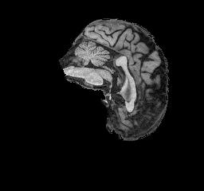
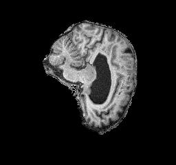
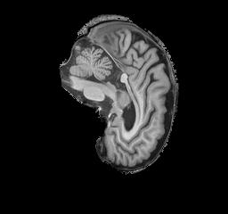
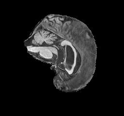

#### NC

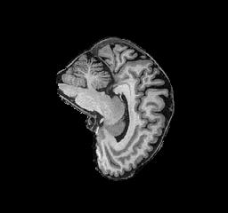
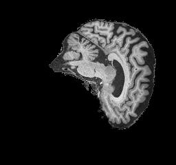
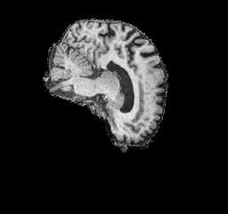
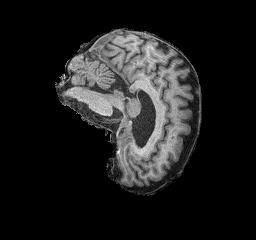

## File structure

* `config.py`: defines configuration parameters used by models
* `dataset.py`: loads data from the dataset, and apply data augmentation
* `modules.py`: defines the models and components used
* `train.py`: contains the main train loop
* `predict.py`: a simple command line tool for generating brain images
* `umap-vis.py`: visualise latent space

## How it works

### Overview

During training, Gaussian noise is gradually added to an image. 
After certain steps, the image will be corrupted to random noise.
A model is trained to reverse this process by removing noise from the image step by step.
During inference, random noise is fed into the network to generate image.
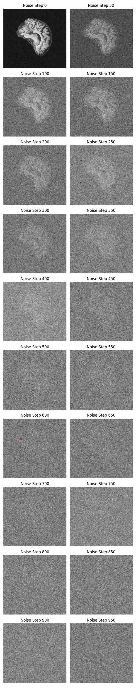

### Mathematical details

First, random noise is added to the image step by step. Let $x_{t-1}$ be the image generated at step $t-1$.  $x_t$ can be sampled from $\mathcal{N}(\sqrt{\alpha_t}x_{t-1}, \beta_t I)$
where $\beta_t$ (between 0 and 1) is the amount of noise added at time $t$ and $\alpha_t=1-\beta_t$. The distribution of $x_t$ is denoted as $q(x_t|x_{t-1})$ in the [DDPM paper](https://arxiv.org/pdf/2006.11239).

There is a closed form formula for sampling $x_t$ directly from $x_0$:
$
x_t \sim \mathcal{N}(\sqrt{\overline{\alpha}_t}x_0, \sqrt{1 - \overline{\alpha}_t} I)
$ where $\overline{\alpha}_t$ is the product of $\alpha_0$ to $\alpha_t$.

The reverse process does the opposite of the above: given a noisy image, predict a less noisy version of it. In other words, we want to model $q(x_{t-1}|x_t)$. Unfortunately, $q(x_{x-1}|x_t)$ is intactable. However, $q(x_{x-1}|x_t,x_0)$ is tractable. It can be shown using Bayes' rule that $q(x_{x-1}|x_t,x_0)=\mathcal{N}(\mu(x_t,x_0),\tilde{\beta}_t)$

where $\tilde{\mu}(x_t,x_0)=\frac{\sqrt{\overline{\alpha}_{t-1}}\beta_t}{1-\overline{\alpha}_t}x_0+\frac{\sqrt{\alpha}_t(1-\overline{\alpha}_{t-1})}{1-\overline{\alpha}_t}x_t$ and $\tilde{\beta}_t=\frac{1-\overline{\alpha}_{t-1}}{1-\overline{\alpha}_t}\beta_t$. 

$\tilde{\mu}$ can be further simplified using [reparameterisation]([Reparameterization trick - Wikipedia](https://en.wikipedia.org/wiki/Reparameterization_trick)): $\tilde{\mu}=\frac{1}{\sqrt{\alpha_t}}(x_t-\frac{\beta_t}{\sqrt{1-\overline{\alpha}_t}}\epsilon_t)$ where $\epsilon_t$ is the noise added at time $t$. Of course, $\epsilon_t$ is not known during inference, and that's why a neural net is needed predict it.

In training, $t$ is sampled from a uniform distribution in each iteration, and the model is trained to predict noised added at time $t$.

### Latent diffusion

Diffusion models need to sequentially remove noise for many times, and it is slow to run it on large images. Therefore, [this paper](https://arxiv.org/pdf/2112.10752) proposed to use an autoencoder to compress image into a latent space, and perform diffusion in latent space.

### Implementation details

A Variation Autoencoder(VAE) is used to compress image. Both encoder and decoder contains 4 ResNet block list, where the first 3 downsamples feature maps by a half using average pooling. Each ResNet block list has 2 ResNet block. The resulting latent image has dimension 4x30x32. The image below shows 1 ResNet block.

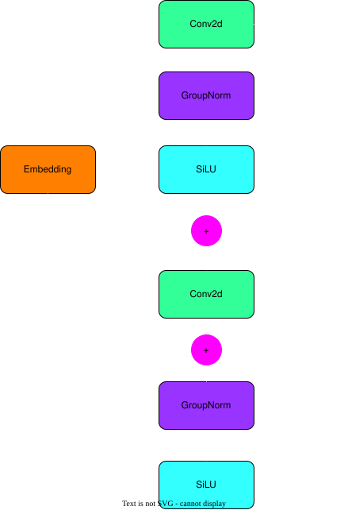

Following [Stable diffusion]([GitHub - Stability-AI/stablediffusion: High-Resolution Image Synthesis with Latent Diffusion Models](https://github.com/Stability-AI/stablediffusion))'s approach, 1000 denoise steps are used. A linear $\beta$ schedule is used with $\beta_0=0.00085$ and $\beta_{999}=0.012$. The scale factor used to scale latent images before diffusion is not used.

A UNet is used to predict noise added at time $t$. Similar to the VAE, it has 4 ResNet block list. Each ResNet block is followed by a self attention layer. It downsamples feature maps twice, in the first 2 ResNet block list.

The UNet can be conditioned on class label. One hot encoded class label is first encoded into a latent vector using an MLP network. Time signal is also encoded into a latent vector using another MLP network, and added to class label latent vector. The embedding vector is then added to feature maps in each ResNet block.

In the [latent diffusion](https://arxiv.org/pdf/2112.10752) paper author proposed a more power embedding mechanism using cross attention. However, it is not used in this implementation because there are only 2 classes, and addition should be sufficient.

In each train iteration, the model is asked to predict a random $t$. To smooth out gradient update, Exponential Moving Average with $\alpha=0.9999$ is used.

## Advantages and disadvantages

### Advantages

* Diffusion models are less sensitive to hyperparameters than GANs

* Recent researches show diffusion models can perform GANs in terms of FID score

### Disadvantages

* Diffusion models are much slower than GANs because it requires sequential denoising, while GANs are one shot

## Data preprocessing

Pixel values are first convert to range`[0, 1]`. Random horizontal is then applied as data augmentation. The full data transform pipeline is shown below(using [`torchvision` transform v2](https://docs.pytorch.org/vision/main/auto_examples/transforms/plot_transforms_getting_started.html#sphx-glr-auto-examples-transforms-plot-transforms-getting-started-py))

### Train

```python
transform = v2.Compose([
    v2.ToDType(dtype=torch.float32, scale=True), # Convert image to [0,1]
    v2.RandomHorizontalFlip()
])
```

### Test

```python
transform = v2.ToDType(dtype=torch.float32, scale=True)
```

In the train set, 2000 images from each class are reserved for validation set, leaving about 8000 train images per class. Test set is left as it. A diffusion model needs a lot of image data to generalise. This split gives sufficient data for the model to learn while leaving enough data for monitoring the model's performance.

## Training

Both network is trained on one RTX 5090 on RunPod.

### VAE

The VAE is trained for 30 epochs and took 26 minutes. [CosineAnnealingLR]([CosineAnnealingLR &#8212; PyTorch 2.9 documentation](https://docs.pytorch.org/docs/stable/generated/torch.optim.lr_scheduler.CosineAnnealingLR.html)) is used as learning rate scheduler. Learning rate is set to `1e-4` initially, and a weight decay of `1e-6` is applied.

Train loss:

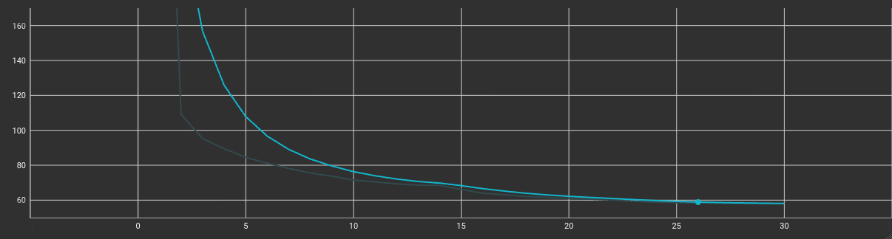Validation loss:

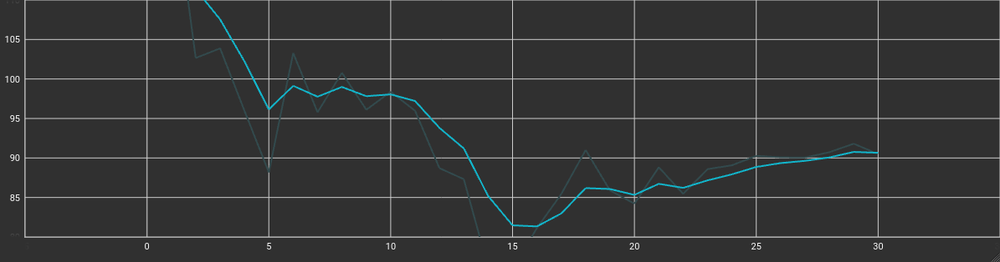

Train GPU usage:

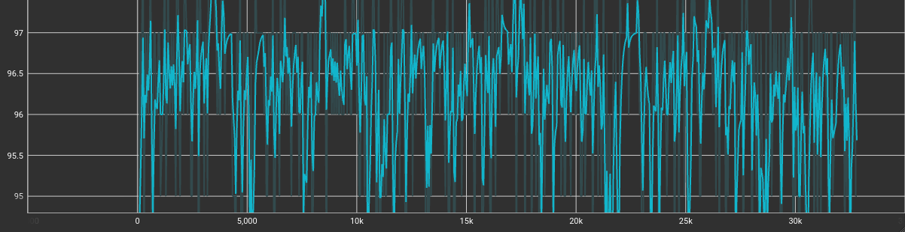

Train loss is steadily decreasing, however validation loss starts increasing after epoch 15, which is a sign of overfitting. It is likely because the model is too complex for this dataset. Stable diffusion is train on large datasets with a lot of variety, where the ANDI dataset only has 2 kinds of brains.

`train.py` saves the model with the lowest validation loss, so the VAE used is the one at epoch 15.

### Diffusion model

The diffusion model is trained for 100 epochs for 3 hours. Learning rate is set to `1e-4`and a weight decay of `1e-6` is used. 

Train loss:

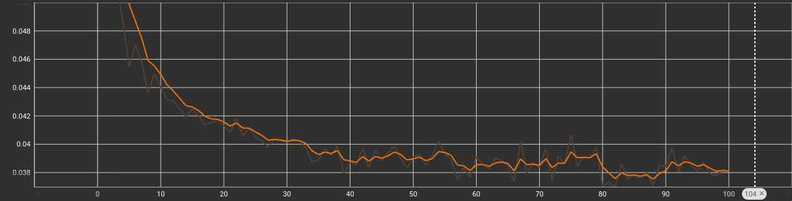

Validation loss:

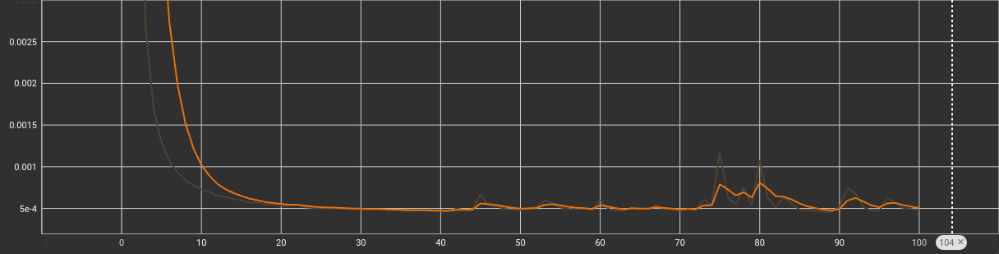

Train GPU usage:

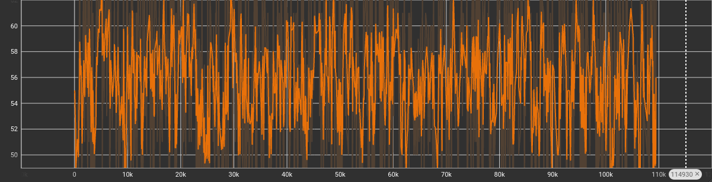

Both train and validation loss are decreasing over time. Train loss is larger than validation loss because during training, $t$ is chosen randomly where during validation $t$ is fixed to 1000. When the model sees an unseen or less seen $t$, it makes sense that the model makes worse prediction.

## Results

### Generated AD brains

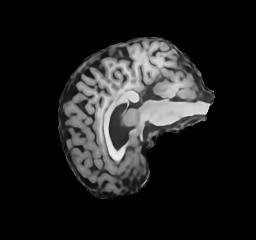

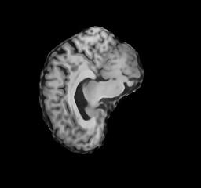

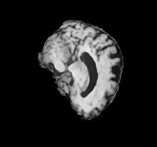

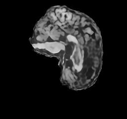

### Generated NC brains

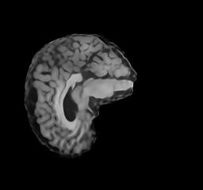

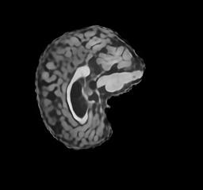

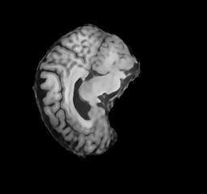

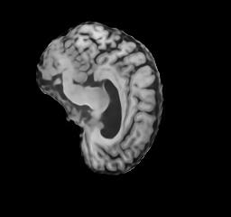

## Diffusion process

The follow images show the diffusion process of generating a NC brain image at $t=900,800,...,0$

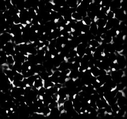
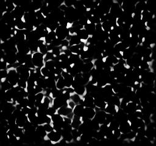
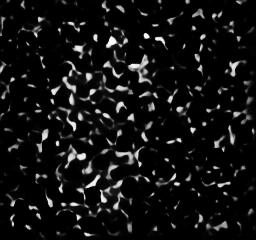
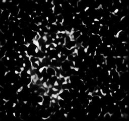
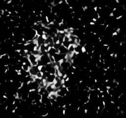
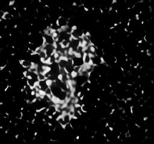
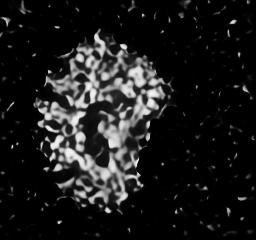
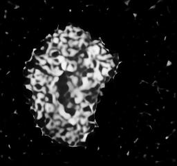
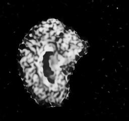
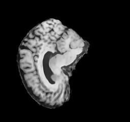

## Other attempts

### Overfitting

At first, batch size is chosen from `[1, 2, 4, 8, 16, 32, 64]` depending on how much memory the GPU has to maximise GPU performance. Also, the KL divergence term is not scaled. The model overfits horribly and generates a lot of noise outside the brain.

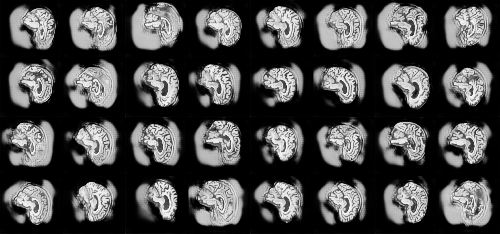

Batch size is capped at 16. The loss function is changed to average over batch size, and a scale of `1e-4` is multiplied to the KL divergence term, and this issue is fixed. Having a smaller batch size can be a form of regularisation, and scaling down the KL term can let the model focus more on reconstructing a realistic image than matching a standard normal distribution.

### LPIPS score

The [LPSIS score]([GitHub - richzhang/PerceptualSimilarity: LPIPS metric. pip install lpips](https://github.com/richzhang/PerceptualSimilarity)) resembles how a human percept an image better than MSE. Therefore, I attempted to replace the MSE loss with LPSIS. The model was able to capture more details, but the model also add some noise to the image. I consider the model performs worse overall compare the MSE version and abandoned LPSIS score. However, the LPSIS score is averaged across all pixels and is about 10-100 times smaller than the MSE one. Further adjustment might improve the performance of the current VAE.

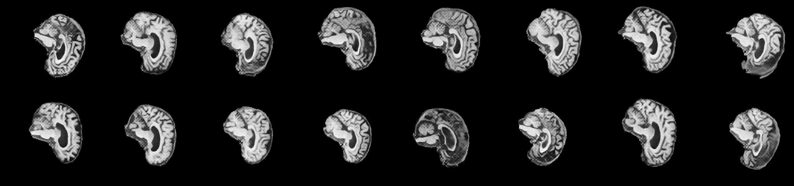

## UMAP latent space visualisation

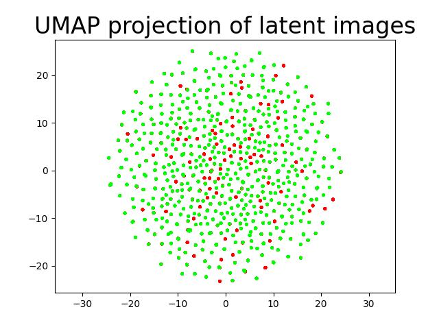

This shows the latent images encoded by the VAE. 8192 images from each class is used to generate this plot. Red represents label AD and green represents NC. As shown in the image, they overlap a lot, to a point red dots are covered by green plots. This shows that the VAE cannot really distinguish between AD and NC brains.

The points form a sphere, which the shape of a bivariate normal distribution with mean 0 and identity covariance. This shows that KL divergence term is effective.

This result should be interpreted with caution as`UMAP` faced some trouble when generating this figure. It generated two warnings:

* `UserWarning: Graph is not fully connected, spectral embedding may not work as expected.` 

* `UserWarning: Spectral initialisation failed! The eigenvector solver
  failed. This is likely due to too small an eigengap. Consider
  adding some noise or jitter to your data.`

## FID Score

4000 images is generated for both classes, and FID scores is calculated for generated images and test set. Our model scores 72.9 for AD images and 75.5 for NC images. This reflects that the image generated by our model is very different from the dataset. 

Ont possible reason is while the VAE captures the overall brain structure, it blurs out detail patterns. For example, the pattern in the circled part is usually not captured by the VAE.

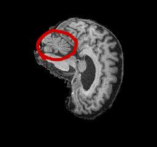

Also, some generated brain images is flipped horizontally due to data augmentation. This could be another source of deviation.

## Dependencies

* `torch==2.8.0`

* `torchvision==0.23.0`

* `nvidia-ml-py==13.580.82`

* `tensorboard==2.20.0`

* `tqdm==4.67.1`

Optional, only used in `umap-vis.py`

* `umap-learn=0.5.9`

* `matplotlib==3.10.7`

* `scikit-learn==1.7.2`

Optional, for calculating FID score

* `pytorch-fid==0.3.0`

## Environment requirements

While this implementation is written in a mostly hardware-agnostic manner, it is only test on CUDA gpus.

This implementation is tested on Python 3.11 and 3.12.

## Run instruction

To train the model, run

`python3 train.py`

`train.py` assumes the ANDI dataset is placed in `data`. Weight for VAE will be saved to `vae.pt` and weight for diffusion model will be saved to `diffusion_model.pt`

To generate images, run 

`python3 predict.py --andi-path=<path to dataset>`

## Bug

`train.py` was written with distributed training support. However, currently it has a bug that blocks indefinitely in the constructor in `DistributedDataParallel`. If your environment has more than 1 GPU, set the ``CUDA_VISIBLE_DEVICES`` environment variable to one of them.

## Reference

https://arxiv.org/pdf/2006.11239

https://arxiv.org/pdf/2112.10752

[GitHub - Stability-AI/stablediffusion: High-Resolution Image Synthesis with Latent Diffusion Models](https://github.com/Stability-AI/stablediffusion)

[GitHub - CompVis/latent-diffusion: High-Resolution Image Synthesis with Latent Diffusion Models](https://github.com/CompVis/latent-diffusion)

[GitHub - hojonathanho/diffusion: Denoising Diffusion Probabilistic Models](https://github.com/hojonathanho/diffusion)

[GitHub - w86763777/pytorch-ddpm: Unofficial PyTorch implementation of Denoising Diffusion Probabilistic Models](https://github.com/w86763777/pytorch-ddpm)

[What are Diffusion Models? | Lil&#39;Log](https://lilianweng.github.io/posts/2021-07-11-diffusion-models/)

https://medium.com/@steinsfu/diffusion-model-clearly-explained-cd331bd41166
